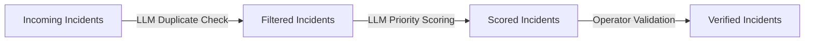

# OptiMove AI™ - LTA Incident Management System

[](https://opensource.org/licenses/MIT)
[](https://www.python.org/downloads/)
[](https://streamlit.io)
[](https://fastapi.tiangolo.com/)

**OptiMove AI™** is a full-stack incident management system designed to help traffic operators monitor, verify, and prioritise real-time traffic incidents. The system features an interactive dashboard that visualizes incidents on a map, live-updating tables, and an AI-powered backend for intelligent filtering and prioritization.

[🎥 Watch the full 5-minute demo](thumbnail.jpg)(https://youtu.be/mWdMDd9snf4)  
*(Click to see OptiMove AI in action)*

---

## 🚦 Why This Matters

Traffic operators face a constant stream of incident reports from multiple sources, making it difficult to prioritise and respond quickly. Manual filtering often results in duplicated reports, wasted time, and slower response rates.  
OptiMove AI™ uses AI-powered filtering and scoring to cut through the noise, helping operators focus on the most urgent incidents and improving dispatch times by **up to 25%**, cost-savings of **up to 30%**, and a reduction of congestion of **up to 30%**.

---

## 🧠 How the AI Works

The AI processing pipeline transforms raw incoming reports into validated, high-priority incidents ready for dispatch:

1. **Incoming** – Raw reports from crowdsourced feeds and external sources (e.g., Waze, LTA DataMall) arrive in the system.
2. **Filtered** – The AI (via an LLM) checks for duplicates and removes noise, creating a clean set of unique incidents.
3. **Priority Scoring** – The same LLM assigns an urgency score based on incident type, severity keywords, and contextual data.
4. **Verified** – Operators review filtered incidents, approve or reject them, and dispatch approved incidents to relevant agencies.



---

## 📋 Table of Contents
- [Features](#-features)
- [System Architecture](#-system-architecture)
- [Tech Stack](#-tech-stack)
- [Project Structure](#-project-structure)
- [Getting Started](#-getting-started)
  - [Prerequisites](#1-prerequisites)
  - [Installation](#2-installation)
  - [Configuration](#3-configuration)
- [Running the Application (Locally)](#-running-the-application-locally)
- [Deployment on AWS EC2](#-deployment-on-aws-ec2)
- [License](#-license)

---

## ✨ Features

###  Frontend (Streamlit Dashboard)
- **Interactive Map:** Real-time map visualization of all incidents using Pydeck, with custom icons color-coded by priority level (High, Medium, Low).
- **Live Data Tables:** Three auto-refreshing tables for tracking incidents through their lifecycle:
  - `📨 Incoming Incidents`: A raw, unfiltered feed of all reported events.
  - `🔍 Filtered Incidents`: AI-processed, de-duplicated incidents awaiting operator validation.
  - `✅ Validated Incidents`: Incidents approved by an operator, with their dispatch status.
- **Operator Workflow:** A seamless process for operators to:
  - **View** detailed incident information, including location, type, and associated images.
  - **Approve** or **Reject** filtered incidents.
  - **Dispatch** validated incidents with one click to external channels like Telegram and Emergency Services.
- **Dynamic UI:** The interface updates dynamically based on operator actions and incoming data, ensuring a smooth user experience.

### Backend (Python/FastAPI)
- **Real-Time Event Handling:** Ingests and processes data from various sources using a robust event-driven architecture.
- **AI-Powered Filtering:** Leverages AI (e.g., via OpenAI) to calculate a `priority_score`, de-duplicate reports, and filter out noise.
- **Server-Sent Events (SSE):** Pushes live updates to the frontend, ensuring the dashboard reflects the latest data without needing manual refreshes.
- **Data Simulation:** Includes scripts to simulate realistic crowdsourced traffic data (e.g., from Waze), allowing for robust testing and demonstration.

---

## 🏗️ System Architecture

The application follows a modern, event-driven architecture to ensure real-time data flow from source to operator.

1.  **Simulation:** The `crowdsource_simulation.py` script generates mock traffic events and sends them to the backend.
2.  **Ingestion:** The backend receives these raw events into the `crowdsource` store.
3.  **Processing & Filtering:** The backend processes incoming events, calculates a priority score, and aggregates duplicate reports into a single, unique incident in the `filtered` store.
4.  **Live Updates:** The backend pushes event IDs to the frontend via Server-Sent Events (SSE) whenever a new filtered incident is created.
5.  **Operator Validation:** The operator reviews the filtered incident on the Streamlit dashboard and decides to **Approve** or **Reject** it.
6.  **Dispatch:** Upon approval, the incident is moved to the `validated` store, and the operator can dispatch alerts to external services like Telegram.

---

## 🛠️ Tech Stack

- **Frontend**: Streamlit, Pydeck, Pandas, Requests
- **Backend**: Python, FastAPI, SSEClient
- **AI Integration**: OpenAI (for priority scoring/analysis)
- **Data Format**: JSON
- **Deployment**: Instructions available for AWS (`aws-config.md`)

---

## 📂 Project Structure

```
lta_hackathon-main/
│
backend/
├── client.py                    # Shared HTTP/client helpers
├── README.md
├── __init__.py
├── llm/                         # LLM integration (Azure/local)
│   ├── __init__.py
│   ├── filter_crowdsource.py    # LLM-based duplicate filtering
│   ├── model.py                 # Loads env + exposes FILTERER/PRIORITIZER
│   └── prioritizer.py           # LLM-based priority scoring
├── schema/                      # Pydantic-style schemas / models
│   ├── __init__.py
│   └── incident.py              # Incident request/response/data models
├── scripts/
│   ├── crowdsource_simulation.py  # Simulates incoming crowdsource incidents
│   └── lta_datamall/
│       ├── app.py                # Mock LTA DataMall server
│       └── handler.py            # DataMall endpoints/handlers
└── server/
│   ├── app.py                   # Main backend entrypoint
│   ├── event_handler.py         # Wires managers + event flow
│   └── manager/                 # Pipeline stages
│       ├── crowdsource_manager.py # Ingests "incoming" incidents
│       ├── filtered_manager.py    # De-dup to "filtered" (uses FILTERER)
│       └── verified_manager.py    # Operator validation → "verified"
│
├── frontend/
│   ├── frontend.py             # Main Streamlit dashboard application
│   └── styles.css              # Custom CSS for the dashboard
│   └── start_simulation.py     # Starts simulation to generate mock traffic incidents
│
├── .env.example                # Example environment variables file
├── requirements.txt            # Python dependencies
├── README.md                   # This file
└── ...
```

---

## 🚀 Getting Started

Follow these steps to set up and run the project locally.

### 1. Prerequisites
- [Git](https://git-scm.com/)
- [Python 3.9+](https://www.python.org/downloads/)
- A virtual environment tool (like `venv`)

### 2. Installation

```bash
# Clone the repository
git clone https://github.com/your-username/lta_hackathon-main.git
cd lta_hackathon-main

# Create and activate a virtual environment
python -m venv .venv
# On Windows:
# .venv\Scripts\activate
# On macOS/Linux:
source .venv/bin/activate

# Install the required dependencies
pip install -r requirements.txt
```

### 3. Configuration

Create a `.env` file in the root of the project directory by copying the example file.

```bash
cp .env.example .env
```

Now, open the `.env` file and add your secret keys and configuration details.

```dotenv
# .env

# --- Backend Configuration ---
# Your OpenAI API key for AI-powered features
OPENAI_API_KEY="sk-..."

# --- Frontend Configuration ---
# Your Telegram Bot token for sending alerts
TELEGRAM_BOT_TOKEN="123456:ABC-DEF1234ghIkl-zyx57W2v1u123ew11"

# The base URL of your backend server (optional, defaults to localhost)
BASE_URL="http://localhost:5000"
```
> **Note:** The Telegram channel for dispatching is hardcoded to `@optimove_ai` in `frontend.py`. Ensure your bot has permission to post there.

---

## 👟 Running the Application (Locally)

To run the full application locally, you will need to open **3 or 4 separate terminal windows** (with the virtual environment activated in each).

**1. Terminal 1: Start the LTA DataMall Mock Server**
This server simulates an external data source.

```bash
python -m backend.scripts.lta_datamall.app
```
> You should see output indicating the server is running on `http://localhost:8000`.

**2. Terminal 2: Start the Main Backend Server**
This is the core of our application that handles event processing.

```bash
python -m backend.server.app
```
> You should see output indicating the server is running on `http://localhost:5000`.

**3. Terminal 3: Start the Frontend Dashboard**
This runs the Streamlit web interface.

```bash
streamlit run frontend/frontend.py
```
> Your browser should automatically open to the dashboard at `http://localhost:8501`.

**4. Terminal 4 (Optional): Run the Data Simulation**
To see the system in action, run this script to generate mock traffic incidents.

```bash
python backend/scripts/crowdsource_simulation.py
```
> After running this, you will see new incidents appear in the "Incoming Incidents" table on the dashboard in real-time.

---

## ☁️ Deployment on AWS EC2

This project is pre-deployed on an AWS EC2 instance. Follow these steps to access and manage the running application.

### Prerequisites

You must have the private key file `lta_hackathon_pair.pem` to access the server.

### 1. Connect to the Virtual Machine

Open your terminal, navigate to the directory where you saved the `.pem` file, and run the following command to connect via SSH:

```bash
ssh -i "lta_hackathon_pair.pem" ubuntu@ec2-13-213-52-104.ap-southeast-1.compute.amazonaws.com
```

> **Note:** When connecting for the first time, you may be prompted about the host's authenticity. Type `yes` to continue. You'll know you're connected when your terminal prompt changes to something like `ubuntu@ip-172-31-...`.

### 2. Manage the Application with `tmux`

The application processes are managed using `tmux`, a terminal multiplexer that keeps them running even after you disconnect.

An existing `tmux` session is already active. To connect to it, run:

```bash
tmux attach
```

This will open a session with multiple windows and panes where the servers are running.

### 3. Controlling the Servers

The `tmux` session is pre-configured for convenience:

-   **Backend Servers:** The first window has two panes. If the servers aren't running, you can start them with these commands (one in each pane):
    ```bash
    # Main Backend Server
    flask -A backend.server.app run --host=0.0.0.0 --port=5000

    # LTA DataMall Mock Server
    flask -A backend.scripts.lta_datamall.app run --host=0.0.0.0 --port=8000
    ```

-   **Frontend Server:** The second window runs the Streamlit frontend. To start it, run:
    ```bash
    # Streamlit Frontend
    streamlit run frontend/frontend.py
    ```

> To stop a running process in any pane, press `Ctrl+C`.

### 4. Accessing the Dashboard

Once the servers are running, you can access the OptiMove AI™ dashboard in your web browser by navigating to the server's public IP address with the Streamlit port (8501):

**[http://13.213.52.104:8501](http://13.213.52.104:8501)**

### 5. Disconnecting

When you are finished, you can simply **close your terminal window**. The `tmux` session will remain active in the background, keeping the application online. You do not need to manually stop the servers unless you intend to shut them down.

---

## 📜 License

This project is licensed under the MIT License - see the `LICENSE` file for details.


